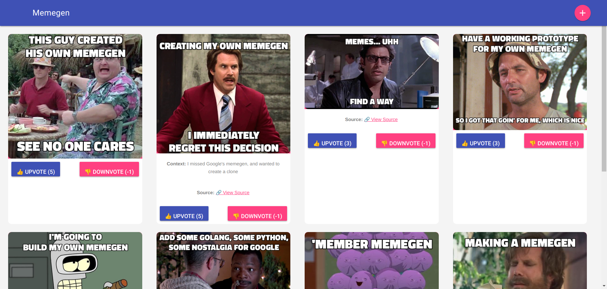

# 🖼️ Meme Generator

A self-hosted **meme generation platform** that allows users to:
- Create memes using a variety of templates 🎨
- Add **context** and **external links** for reference 🔗
- Vote on memes with **upvotes/downvotes** 👍👎
- Cache images for faster performance using **Redis** ⚡
- Material UI




## 🚀 Features
- **Live Meme Previews** before creation
- **Material Design UI** for a modern experience
- **SQLite Database** to store meme metadata
- **Redis Caching** to speed up image loading
- **Memegen API Proxying** to hide backend details
- **Supports External Links** (e.g., news articles, tweets)

---

## 📦 **Setup & Installation**
### **1️⃣ Clone the Repository**
```sh
git clone https://github.com/yourusername/meme-generator.git
cd meme-generator
```

### **2️⃣ Start the Services**
Ensure Docker and Docker Compose are installed, and then bring up the supporting containers:
```sh
docker-compose up -d
```

This will start:

 - Memegen API (backend)
 - Redis (for caching)

### **3️⃣ Build the Golang Binary**

```sh
go build
```

Then run the binary:
```sh
./go_memegen
```

You can visit the webUI at:

http://localhost:8181

## Database

Memegen uses a sqlite database for metadata about the memes:

```
CREATE TABLE IF NOT EXISTS memes (
    id INTEGER PRIMARY KEY AUTOINCREMENT,
    template TEXT,
    topText TEXT,
    bottomText TEXT,
    url TEXT,
    context TEXT DEFAULT '',
    link TEXT DEFAULT '',
    votes INTEGER DEFAULT 0
);
```

## **🎨 API Endpoints**
The server exposes the following API routes:

### **📌 1. Generate a Meme**
**Request**:
```
POST /generate
Content-Type: application/x-www-form-urlencoded
```

**Parameters**:

| Field	   | Description	                  | Required | 
|----------|--------------------------------|----------|
| template | Template ID (from /templates)  |	✅ Yes   |
| top	     | Top text	                      | ✅ Yes   |
| bottom   | Bottom text	                  | ✅ Yes   |
| context	 | Context (optional)	            | ❌ No    |
| link	   | External link (optional)	      | ❌ No    |

**Response**: Redirects to /.

📌 2. Get Meme List
**Request**:
```
GET /
```

**Response**: HTML page displaying all memes.

📌 3. Upvote/Downvote a Meme
**Request (Upvote)**:

```
POST /vote/{id}/up
```

**Request (Downvote)**:

```
POST /vote/{id}/down
```

**Response**: Redirects to / with the updated vote count.

📌 4. Serve Cached Memes via Redis
**Request**:

```
GET /meme/{id}
```

**Response**: Meme image

🖼️ Live Preview Support
The meme creation form updates the preview image dynamically.

```

<script>
function updatePreview() {
    let template = document.getElementById("template").value;
    let topText = encodeURIComponent(document.getElementById("top").value.trim().replace(/ /g, "_"));
    let bottomText = encodeURIComponent(document.getElementById("bottom").value.trim().replace(/ /g, "_"));
    document.getElementById("memePreview").src = `/api/images/${template}/${topText}/${bottomText}.png`;
}
</script>
```
